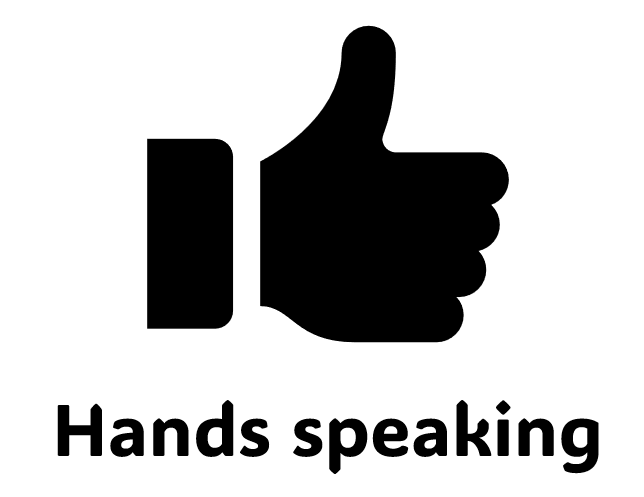
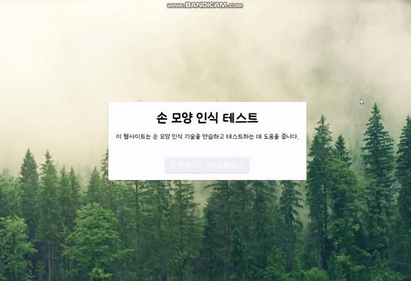
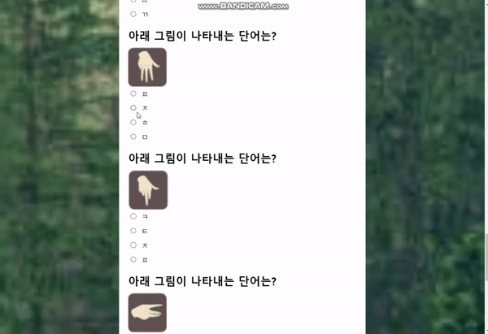

# Hand_recognition
### : 누구나 쉽게 익힐 수 있는 지문자

  

  

# 목차
1. [페이지 설명 (detail of page)](#페이지-설명-detail-of-page)
   - [1. 공부하기 페이지](#1-공부하기-페이지)
   - [2. 테스트 페이지](#2-테스트-페이지)
     - [쉬움 난이도](#쉬움-난이도)
     - [보통 난이도](#보통-난이도)
2. [기술 스택](#기술-스택)
3. [요약](#요약)
4. [팀원](#팀원)
  

## 페이지 설명 (detail of page)

### 1. 공부하기 페이지
지문자 표를 이용한 학습페이지

  

  

### 2. 테스트 페이지

### 쉬움 난이도
php, html/css를 사용하여 만든 페이지로써, 사용자가 이미지를 보고 해당 이미지에 대한 질문에 답하는 퀴즈 페이지(난이도: 쉬움) 입니다. 퀴즈는 여러 개의 질문으로 구성되어 있으며 각 질문은 관련된 이미지와 함께 표시됩니다. 

    
    

### 보통 난이도
사용자가 공부한 내용을 바탕으로 웹캠을 사용하여 손 동작을 인식하여 문제를 푸는 퀴즈형식으로 구성되어 있습니다. Flask의 SocketIO를 사용하여 실시간 연결을 지원하며 MySQL에 저장되어있는 문제중 랜덤으로 출제합니다. Flask의 MediaPipe 라이브러리를 사용하여 웹 캠에서 손의 위치와 각도를 인식하고, TensorFlow Lite모델을 통해 손 제스처를 분류한 뒤, 타이머가 종료되면 인식된 손 동작을 DB의 정답과 비교하여 채점하는 방식으로 진행되었습니다.  

    
    

  

  

## 기술 스택
- 👓 **Front-End**: Html/CSS/JavaScript, Socket.IO
- 🕶 **Back-End** : Flask, TensorFlow 및 MediaPipe, MySQL, WebSocket

  

  

## 요약
-필기부분: 
수어 지문자의 이미지를보고 무슨 글자인지 정답을 맞추며 점수를 알려준다.

-실기부분: 
mediapipe를 사용하여 손의 랜드마크 간 각도를 계산하고, tensorflowlite 모델을 사용하여 웹캠에서 손을 인식하고 결과를 반환하는 Python 코드다. 또한, 이 코드는 socket을 열어 서버로 작동하며, JavaScript를 사용하는 클라이언트와 상호작용한다.

## 팀 정보
|  팀원  |     역할     |     GitHub     |         Email         |
| :----: | :----------: | :------------: | :-------------------: |
| 김기원 |  Full-Stack  |   wkdrldnjs   |  jjy1215a64@gmail.com |
| 전하영 |  Full-Stack  |   Hayeong-Jeon  |  wjsgkdd@gmail.com  |
